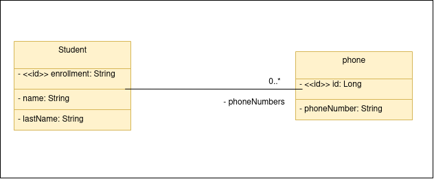

# 💻 Back end Desafio Forleven

A api foi desenvolvida como um teste para a Forleven. 

A api permite cadastrar, listar, editar e remover estudantes. 

A implantação da api foi feita utilizando a AWS, com os serviços EC2 e RDS.

**Em um futuro próximo, irei transferir para o heroku**

- Link do back end: http://ec2-54-94-193-95.sa-east-1.compute.amazonaws.com/students

## 🔌 Configurações para inicialização
- **Você precisa ter o java jdk 11 instalado na sua máquina bem como o `PATH_VARIABLE` do
java configurado e uma IDE de sua preferência.**

- **O backend está setado em modo de teste, dessa forma, não é necessário nenhum tipo de
configuração para banco de dados, pois está sendo utilizado o banco de dados em memória (H2).**

- **Caso queira utilizar o modo de desenvolvimento, é necessário ter o postgresql instalado e
configurado na sua máquina. Troque em `./src/main/resources/application.properties`, `spring.profiles.active=test` por `spring.profiles.active=dev`.**

Execute o comando: `mvn install` para instalar as dependências do maven.

Após baixar as dependências, execute a aplicação e a api estará rodando em http://localhost:8080.

Acesso ao banco de dados: `http://localhost:8080/h2-console`.

## 🗺️ Diagrama de Classes - Modelo de Domínio



## 📌 Endpoints

Os seguintes endpoints estão configurados:

### Students

- `/students` - GET - Exibe todos os estudantes cadastrados na API.
- `/students/{enrollment}` - GET - Exibe as informações de um estudante específico bem como quais são seus telefones.
- `/students` - POST - Cria um estudante.
- `/students/{enrollment}` - PUT - Atualiza as informações de um estudante específico.
- `/students/{enrollment}` - DELETE - Remove um estudante específico.

**Exemplo de dados para CRIAR um Estudante COM telefone(s) (JSON)**

```json
{
  "enrollment": "6637",
  "name": "Robert",
  "lastName": "Martin",
  "phoneNumbers": [
    {
      "phoneNumber": "98570-3107"
    },
    {
      "phoneNumber": "96352-4517"
    }
  ]
}
```

**Exemplo de dados para CRIAR um Estudante SEM telefone(s) (JSON)**

```json
{
  "enrollment": "6637",
  "name": "Robert",
  "lastName": "Martin"
}
```

**Exemplo de dados para ATUALIZAR um Estudante (JSON)**

```json
{
  "name": "Robert Edited",
  "lastName": "Martin",
  "phoneNumbers": [
    {
      "phoneNumber": "98877-5544"
    }
  ]
}
```

## 🛠️ Ferramentas

1. Java
2. Springboot
3. Spring Web   
4. Spring Data JPA
5. Spring Validation
6. AWS
7. Docker
8. H2 database
9. postgresql

## 💾 Dados para povoar a api

Na pasta `src/main/resources` existe um arquivo **data.sql** com alguns dados já adicionados, para
inserir novos dados **manualmente**, basta incluí-los no arquivo. 